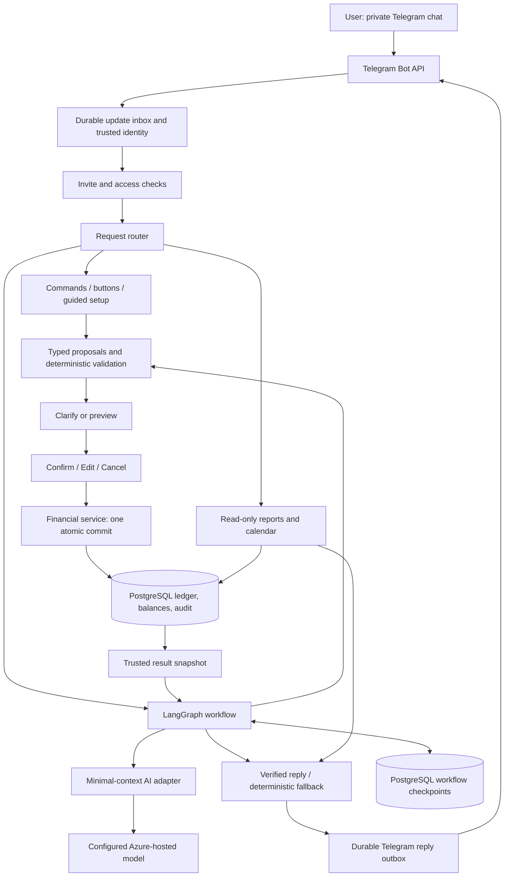

# High-level design — Telegram budget bot

**Status: design and implementation defaults approved; not yet implemented or provisioned.** Product decisions are in [REQUIREMENTS.md](REQUIREMENTS.md); detailed contracts are in [LLD.md](LLD.md). The owner approved implementation, dedicated project app/test databases and roles/schemas on the existing server, separately routed workers, bounded synthetic API checks, and GitHub publication to the specified `main` branch. Connection credentials and local onboarding remain setup gates; production hosting and operational decisions are separate.

## 1. Recommended approach

Build a **modular monolith**: one Python application with separate modules for Telegram, workflows, money rules, storage, reports, and AI. This avoids managing several services for the first version, while keeping domain logic independent of Telegram and the model.

| Component | Proposed technology | Why / owner-visible effect |
|---|---|---|
| Runtime | Python 3.11, project-local uv environment | Python is already available; dependencies stay outside Hermes's environment. Pin dependencies in the project's lockfile during implementation. |
| Telegram | python-telegram-bot, explicit durable polling loop | Commands, text, buttons, and calendar stay in Telegram. Start with outgoing connections, not a public web server. |
| AI workflow | LangGraph StateGraph with PostgreSQL checkpoints | Explicit paths for interpretation, clarification, review, commit, and reply. Checkpoints retain pending conversations across restarts.[6] |
| Interpretation | Pydantic typed schemas + provider adapter | AI proposes supported actions; malformed or ambiguous output cannot directly change balances. |
| Financial persistence | PostgreSQL, SQLAlchemy 2, psycopg, Alembic | Transactions, ownership constraints, locking, migrations, and persistent history. Existing local PostgreSQL server is the preferred starting point, subject to access and provisioning approval. |
| Money representation | Integer paise with checked range | No floating-point money. Model-supplied decimal text is validated before conversion. |
| Calendar | Telegram inline keyboard | Monthly day grid, previous/next month controls, and per-day expense detail. No website, external calendar account, or Mini App. |
| Verification | pytest, real isolated PostgreSQL schema tests, controlled transport tests, bounded live checks | Financial guarantees are checked at the database boundary; mocked adapters and live behavior are reported separately. |

This is a proposed stack, not a claim that these packages are installed. Current Python is 3.11.16; uv, git, PostgreSQL client tools, and Docker are present. PostgreSQL at 127.0.0.1:5432 responds to readiness checks. That does not establish database login permission, existing data ownership, or permission to create anything.

## 2. Architecture and trust boundaries



**Financial authority:** the financial service and database. The model cannot choose user identity, authorize a confirmation, generate SQL, calculate authoritative balances, or write records directly.

**Workflow authority:** persisted requests, review revisions, and authenticated callbacks. A LangGraph checkpoint is conversational state, not proof that a financial action committed.

**Reporting authority:** database-derived report snapshots. AI can phrase facts, not invent report rows or totals.

**Identity authority:** Telegram's authenticated update sender in a private chat, checked against registration/access state. Reject group, channel, inline, and unsupported update paths in version one.

## 3. Money model

Each user owns:

- One **available-money pool** containing unallocated tracked money.
- Named buckets with allocated balances, which may become negative due to expenses.
- An append-only signed posting journal and auditable transaction revisions.
- Optional bucket spending targets, separate from balances.

The financial identity is:

```text
Total tracked money = pool balance + sum(bucket balances)
                    = opening money + net recorded income - net recorded expenses
```

Allocations/transfers change location, not total tracked money. Expense overspending can make a bucket, and even the tracked total, negative. Never label a negative tracked total as spendable bank funds; warn clearly. The pool cannot become negative through allocation or income reversal. Corrections follow the approved funding restrictions, with the detailed policy proposed in LLD.

| Event | Pool effect | Bucket effect | Tracked total effect | Spending-report effect |
|---|---|---|---|---|
| Opening/income | Increase | None | Increase | None |
| Pool allocation | Decrease | Destination increases | None | None |
| Bucket transfer | None | Source decreases, destination increases | None | None |
| Expense | None | Selected bucket decreases; may be negative | Decrease | Increase spending on effective date |
| Undo/correction | Approved compensating postings | Approved compensating postings | Depends on original action | Remove/revise effective expense; preserve audit |
| Monthly target | None | None | None | Warning threshold only |
| Calendar navigation | None | None | None | Read only |

No monthly reset job is needed: balances persist, and report/target windows are calculated by calendar month.

## 4. Main flows

### 4.1 Invite and opening setup

1. Admin generates a single-use invite. Store a digest, not a recoverable plaintext code.
2. User starts the bot privately and supplies the code. Consume it atomically, creating a separate user identity.
3. Setup asks one question at a time: starting INR amount, buckets, initial allocation amounts, optional targets, and timezone (India default). Back/Cancel are available.
4. Review the entire opening plan. No starting money or allocations are committed before Confirm.
5. Commit the plan once, then show the main menu, balances, and Calendar button.

A single-use invite is a bearer credential: the first eligible person redeeming it gets access. Expiry/revocation and attempt limits mitigate misuse; they do not bind it to a named person unless admin adds a separate restriction.

### 4.2 Natural-language mutation

1. Persist and deduplicate the Telegram update before acknowledging its polling offset.
2. Authenticate user; load only that user's relevant bucket context.
3. LangGraph asks the model for a typed action plan. Distinguish missing information from guessed details.
4. Resolve bucket labels and dates deterministically; ask clarification questions if needed.
5. Compute an ordered batch preview, including balances, shortages, and warnings.
6. Show Confirm / Edit / Cancel. Confirmation is tied to user, exact plan revision, and current money-state revision.
7. On Confirm, revalidate and atomically apply the batch. Changed state requires a new review; a past confirmation cannot approve different effects.
8. Render the committed result conversationally. An AI failure after commit must not cause another financial write.

Commands/buttons skip model interpretation but use the same proposals, review rules, and financial service. This is how AI outages preserve core functionality.

### 4.3 Reports and calendar

A command/button or validated AI query selects a bounded day/week/month/date-range report. The backend aggregates **active corrected expense records**, scoped to the requester. Transfers, income, and undone expenses do not count as spending.

Calendar uses a server-side, owner-bound navigation session with month/day tokens. Tapping a day is a read-only report. It shows a spending total, bucket breakdown, and paginated expense details. A day without expenses says so explicitly. Calendar does not allocate daily budgets or create reminders.

Natural-language queries use the AI to select relevant facts and conversational phrases from an approved backend-owned catalog, not to generate unchecked financial claims. The authoritative amount/date/bucket lines and mandatory warnings are formatted by the backend.

### 4.4 Correction and undo

Find recent owner-scoped transaction candidates; resolve ambiguous references with buttons. Show old versus proposed details, balance effects, and warnings. Do not edit Telegram messages to mutate already recorded money: use the explicit correction workflow.

Keep original records, append revisions/reversal postings, and update the effective report view in one database transaction. Insufficient recovery funds block the entire change. Proposed detailed reversal semantics are in [LLD.md](LLD.md#corrections-and-undo).

## 5. LangGraph design

Use bounded named nodes rather than an unrestricted autonomous tool loop:

```text
START -> normalize -> interpret (NL only) -> resolve/validate
                                  |              |
                                  |         missing fields -> clarify interrupt -> validate
                                  |              |
                                  |              +-> query -> report service -> render -> END
                                  |              |
                                  |              +-> mutation -> preview -> review interrupt
                                  |                                      |
                                  |                        Edit -> new preview/review
                                  |                        Cancel -> END
                                  |                        Confirm -> revalidate -> commit
                                  |                                                  |
                                  +-----------------------------------------> render -> END
```

Checkpointed threads let a workflow pause and resume, but LangGraph restarts the interrupted node from its beginning on resume. Keep financial side effects out of clarification/review nodes; all replayable mutations must have durable idempotency.[1][6]

Use one thread per owner-scoped request, not one global chat thread for all actions. General read-only queries may run while a money review waits. Proposed version-one UX allows one pending mutation per user; a new mutation asks whether to resume or cancel the existing one.

## 6. Existing AI provider: discovered configuration

Read-only local discovery returned:

| Field | Observed value |
|---|---|
| Configured provider name | `azure-kiro-sol61` |
| Model | `gpt-6.1-sol` |
| HTTPS base URL | `https://<your-resource>.openai.azure.com/openai/v1` |
| Credential reference | `AZURE_KIRO_API_KEY` |
| Referenced credential present | Yes; value not printed, copied, or embedded in documents |
| API mode in model settings | Not explicitly specified |
| Bot-specific live compatibility | Not tested |

Hermes's supported config-path commands located the active files; its settings/key separation and environment references are documented.[4][5] Do not change Hermes settings or import its general-purpose agent/tools into the bot.

**Proposed adapter:** OpenAI Python SDK against this exact HTTPS base URL, using the configured deployment/model. Prefer Responses with strict structured output if an authorized compatibility probe confirms support; otherwise use a validated structured-output alternative only after documenting the tested protocol. Azure's official Responses documentation is background, not proof that this particular deployment supports the required schema.[8]

**Credential handling during later implementation:** reuse only the referenced AI credential through an explicitly authorized, ignored project secret file or deployment secret. Do not copy Hermes's whole environment. Do not put the key in HLD/LLD, logs, code, test fixtures, callbacks, or Git. Sharing the credential shares provider quota/billing and failure/revocation risk; there is no verified cost estimate yet. Request `store=False` when supported; this is not a guarantee about the provider/operator's retention policy.

Before a live probe, explain that it uses quota. Use fictional budget messages only, bounded token output, no redirects, no SDK retries, and no real Telegram/user financial data. Structured interpretation and fact-constrained reply rendering need separate evidence.

## 7. Persistence, concurrency, and recovery

- **Durable inbox:** store update identity, minimal necessary payload, routing, and work status. Advance the polling offset only after durable ingestion; do not rely on an in-memory handler queue for crash recovery. Telegram documents polling offset confirmation and mutually exclusive webhook/polling modes.[3]
- **Workflow checkpoints:** PostgreSQL-backed LangGraph checkpoints in a separate namespace, managed through the library's supported setup mechanism.[6]
- **Financial transaction:** short database transaction after confirmation; never hold account locks during model calls or while waiting for the user.
- **Serialization:** per-user financial row lock; owner/workflow advisory lock around graph execution; one active mutation review per user.
- **Idempotency:** trusted bot/update identity at ingress, request/review identity at commit, and immutable resume identity. Two separately sent identical expense messages are distinct proposals, not automatically duplicates.
- **Outbox:** committed results and outgoing messages are persisted, then delivered with retry. A Telegram timeout after remote acceptance can still yield a duplicate reply; guarantee single financial application, not exactly-once remote message delivery.
- **State changes during review:** re-preview and require a new confirmation. Never silently adjust a reviewed amount or source.
- **Restarts:** recover uncompleted inbox/resume/outbox work and persisted reviews. Checkpoints alone do not close the gap between money commit and Telegram reply.

## 8. Privacy and operational controls

- Every repository query and constraint is owner-scoped. Admin access methods operate on invites/access state only; no financial browsing endpoint.
- Treat messages, descriptions, and bucket names as untrusted data. No shell, browsing, unrestricted SQL, or external tool access for the budgeting agent.
- Minimize model context: redact explicit credentials/contact/account identifiers without deleting monetary digits; preserve the amount/date tokens necessary for interpretation. Do not send Telegram IDs, usernames, invite codes, or unrelated history.
- Minimal-context replies may send relevant committed amounts/report facts to the same approved provider. A user-supplied secret must not be echoed in reply generation.
- Disable external tracing/telemetry by default. Operational logs contain opaque request IDs, statuses, durations, and sanitized error categories, not raw message text or credentials.
- Proposed bounded AI/message usage and per-user throttling protect a shared API key. Owner must review real provider billing before public expansion.
- Database/backups contain financial data even if the model does not see it. Prefer encrypted host/backup storage and least-privilege database roles; do not claim end-to-end encryption of bot conversations.
- Invite expiry, pending-request expiry, backup/retention, and access revocation defaults need review below.

## 9. Resource inventory — existing versus proposed

| Resource | Existing state / proposed change | Location and ownership | Approval boundary |
|---|---|---|---|
| Project | Initially empty; this stage creates review documents only | `C:\Users\FL_LPT-657\Projects\telegram_bot` | Documentation authorized |
| Python environment | Existing Python/uv; propose new project-local `.venv` | Inside project; started through uv by owner/coordinator | No install in this stage |
| PostgreSQL server | Existing listener at `127.0.0.1:5432`; propose reuse | Existing Windows service and data directory unchanged | Do not start/stop/change it or create a database without explicit approval |
| Application database | Proposed `telegram_budget` on existing server; name/login not finalized | Financial data remains in PostgreSQL, not source folder | Creating DB/roles/schema requires explicit approval |
| Test data | Proposed isolated disposable schema in a separately approved test database on the same server | Never use the owner's financial tables; cleanup only owned schema | Approval required; no second server/container instance proposed |
| AI | Existing configured Azure endpoint/key; propose narrow SDK adapter | External provider; shared key quota and billing | No paid probe or secret copy in this stage |
| Telegram bot | Token and bot identity not discovered or created | Owner creates through BotFather; later secret entry is local | Separate onboarding; do not reuse Hermes gateway bot token |
| Backend process | Proposed one local outgoing polling process first | Owner/coordinator starts/stops it; laptop must be awake and online | Startup/Telegram connection after setup approval |
| Backups | Not configured; propose encrypted regular backup and tested restore | Location/retention decided before real use | No backup task or external upload in this stage |
| Hosting | Not chosen; optional later always-on host | Separate deployment and cost decision | No Docker/cloud provisioning or public endpoint now |

## 10. Delivery order and evidence

| Slice | Accountable implementer | Observable checkpoint / evidence |
|---|---|---|
| 1. Domain and database foundation | Parent/coordinator | Exact paise arithmetic, ownership, ledger invariants, migrations, and real DB atomicity tests |
| 2. Invite, guided setup, commands | Coordinator; Telegram module may be delegated after contracts freeze | Invite consumption, setup review, menus, expense/allocation/transfer paths with no AI dependency |
| 3. Durable reviews and corrections | Coordinator | Restart/replay, stale confirmation, short-funds reversal, atomic combined actions |
| 4. LangGraph/provider adapter | Bounded independent adapter worker may assist; coordinator integrates | Actual graph with checkpoints, strict schemas, clarifications, AI outage and fact-grounded replies |
| 5. Targets, reports, calendar | Read-only module worker may assist; coordinator integrates | Month/date boundaries, corrected expense aggregates, calendar callbacks and pagination |
| 6. Final verification and onboarding | Coordinator; owner controls credentials and live acceptance | Frozen-tree regression/lint/build, bounded synthetic provider probe, then live Telegram walkthrough |

These are proposed responsibilities, not claims that workers are running. Keep Git local from implementation start; no remote push/deployment without separate approval. Automated evidence, synthetic live model evidence, and owner-operated Telegram acceptance remain distinct.

## Review decisions

Product scope and D01–D09 are **approved for implementation**. D02/D03 setup authorization was also granted for the listed project-only resources and bounded synthetic API use; verified connection details and local credential entry are still required. D10 remains an unresolved operational/deployment gate. Earlier words such as “proposed” describe the unimplemented design, not an outstanding approval for D01–D09.

| ID | Recommendation / unresolved point | Effect if approved |
|---|---|---|
| D01 | Python modular monolith; Telegram inline calendar; long polling locally first | No public web server, Mini App, Redis, or separate scheduler in version one |
| D02 | Reuse existing PostgreSQL server; explicitly authorize app DB, least-privilege roles, and isolated test DB/schema | No additional server/container instance. Need approved names, local credential method, data/backup plan before creation |
| D03 | Verify protocol later with two bounded synthetic requests: action-schema and reply-schema; then reuse only the referenced key | Shared quota/billing; exact adapter chosen from real evidence, Hermes configuration unchanged |
| D04 | One pending mutation per user; 30-minute inactivity expiry; edited proposals require fresh confirmation; queries may run while pending | Reduces ambiguous reply routing and stale approvals |
| D05 | Calendar stores user-entered bookkeeping date; omitted dates use receipt-day in user's timezone; Monday-start weeks; inclusive report ranges | Historical stated dates stay stable when timezone changes; UTC receipt/audit timestamps remain separate |
| D06 | Corrections use net compensated effects per logical action, reject funded-source shortfalls, and preserve original versions; 'undo last' selects last committed financial batch | Avoids blocking an increase solely because original income is already allocated; no rewriting history |
| D07 | Targets persist month-to-month; changing a target applies to the current month onward; warn on threshold crossing and on subsequent new overspending | No scheduled reminders or monthly money reset |
| D08 | Invites expire after seven days and can be revoked; admin may revoke user access without deleting history | Requires clear admin revocation UX and rate limits; not admin financial access |
| D09 | Initial operating defaults: max 10 actions/message, 20 AI-dependent messages/user/day, one in-flight AI call/user, 30-second provider deadline | Adjustable non-secret limits. Token limits/probe caps finalized against provider support |
| D10 | Backups, retention/deletion requests, production host, expected scale, and cost cap remain unresolved operational decisions | Resolve before real-user/always-on deployment; no silent public deployment or financial-data upload |

D01–D09 and project-only D02/D03 setup/probe scope are authorized. Verify PostgreSQL connection/local credentials and provider protocol before using them; no resources have been provisioned merely by approval. D10 does not prevent local coding with fictional data, but remains a real-use deployment gate.

## Sources

[1] https://docs.langchain.com/oss/python/langgraph/interrupts
[3] https://core.telegram.org/bots/api
[4] https://hermes-agent.nousresearch.com/docs/user-guide/configuration
[5] https://hermes-agent.nousresearch.com/docs/integrations/providers
[6] https://docs.langchain.com/oss/python/langgraph/checkpointers
[8] https://learn.microsoft.com/en-us/azure/ai-foundry/openai/how-to/responses?view=foundry-classic
